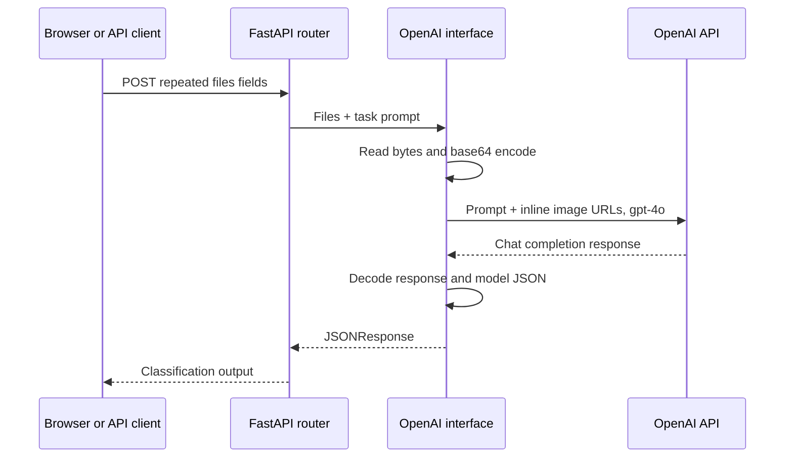

# Architecture

[README](../README.md) · [Setup](SETUP.md) · [API](API.md)

## Source map

| File | Responsibility |
| --- | --- |
| `vehicle_image_recognition/main.py` | FastAPI app, router registration, static mount, and HTML page |
| `vehicle_image_recognition/api/endpoints.py` | Two multipart upload routes |
| `vehicle_image_recognition/prompts.py` | Content and orientation instructions |
| `vehicle_image_recognition/services/openai_interface.py` | Image encoding, upstream HTTP call, and JSON parsing |
| `vehicle_image_recognition/static/index.html` | Image preview, endpoint toggle, request submission, and labels |
| `requirements.txt` | Historical dependency ranges |

The endpoint module also declares a separate `FastAPI()` instance, but the served application is the instance in `main.py` with the router included. `api/models.py` and `utils/helpers.py` are empty placeholders.

## Request lifecycle

## Integration choices

Both tasks share one request implementation; their behavior changes through prompts. This keeps the transport code small and makes prompt editing easy to locate.

The code imports the OpenAI package to store the API key, but performs the actual API call with `requests.post`. It does not call the OpenAI SDK's completion methods.

The browser is a plain HTML/CSS/JavaScript interface. It posts files to relative endpoint URLs, so the page and API share the same origin. There is no React implementation in this project.

## Prototype boundaries

The route is asynchronous, but the upstream `requests.post` call is synchronous and can block the event loop. The server does not enforce MIME types, upload limits, output schemas, or validated result ordering. There is no persistence layer, authentication system, committed executable test suite, or measured classification accuracy.

Potential next steps include an async HTTP client with timeouts, explicit file validation, structured response validation, mocked transport tests, a labeled evaluation set, configurable model selection, and resolving static assets relative to the module rather than the working directory. These are extension ideas, not existing capabilities.
